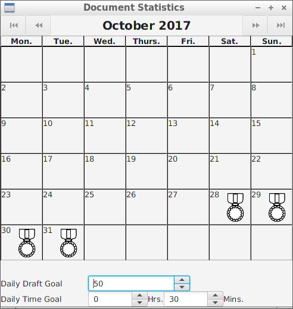

# JWriter

## About
JWriter a word processor with note taking and goal setting ablities. It is
foused for authors to write fiction and non-fiction alike.  Notes can be put
into to the file anywhere yet allow easy to navigate to them. The goal settings
can be adjest as the document written.

Even though the markup language is made for this program, is very forgiving and
will highlight the syntax. In the future, there will be more support and will
have a [WYSIWYG mode](https://en.wikipedia.org/wiki/WYSIWYG). This make learning
the language as just a faster way to format and insert notes and agendas.

This project is currently in alpha version, and will be optimized and will have
more features.

## Markup

### Formats
There are four different formats. Formats can be combined, but are only restrict
to one line.

|Format   |Code          |
|---------|--------------|
|Italics  |`\*Text\*`    |
|Bold     |`\*\*Text\*\*`|
|Underline|`\_Text\_`    |
|Code     |`\`Text\``    |

There are also [footnote (syntax `{^footnote}`), endnote (syntax `{*endnote}`)](#note-styles),
[links (syntax `<@reference id|link text>` or `<link path|link text>`)](#hyperlink),
[agenda (syntax `{! todo}`)](#agenda), and [citation (sytnax `{@id}`)](#notes).

## Sections
Each section had a heading or an outline point at the top of the section. This
markup language allows you to have no heading or outline, but the section has to
be at the top of file. An outline point is nested inside a section with an
heading, or is before the first section with headings.

### Heading and outline

A heading or an outline can have an [id](#id) that can be linked to a
different point of file.  The syntax is `@category-id:` and it set before the
first text, other than the syntax used to indicated the heading and outline
style. Refers to the section by using [`<@id>`](#hyperlink).

There are six level for both headings and outlines.

A heading or an outline can also have a status with details, A status is
optional, and can be `#STUB`, `#DRAFT`, `#FINAL`, `#` (custom) and none. after
the status, there are details to go with the status. It will be at the end of
the line.

The syntax of a heading is:

    = @category-id:Title for largest heading # status
    == Title for heading 2 #DRAFT
    ======Smallest headings

The syntax of a outline is:

    !# Largest outline point
    !######Smallest outline pointe

### Main Line Styles

There are several types of line styles.

|Line styles  |Syntax    |Notes                                                |
|-------------|----------|-----------------------------------------------------|
|Numbered     | `# text` |Add tabs before `#` to increse level (up to six)     |
|Bullet       | `- text` |Add tabs before `-` to increse level (up to six)     |
|Quote        | `> text` |                                                     |
|Section Break| `***`    |It has no text after the `*` or allow spaces anywhere|
|Paragaph     | `text`   |There is no symbol used at the beginning of the line |

### Note Styles
In addition there are footnote, and endnote, that can be referred to even
outside of the section that the line belongs in. Footnotes appears at end of a
page, while endnote appears at the end of either a section or a document.

All footnote and endnotes will have an [id](#id) and text before they can appear
in the printed document.

|Types      |Line Syntax |In Text Syntax|
|-----------|------------|--------------|
|Footnote   | `!^id:text`| `{^id}`      |
|Endnote    | `!*id:text`| `{*id}`      |

Footnote will count by numbers, while endnot count by letters.

### Hyperlink

Hyperlinks can be link to a section or a webpage. If the referred link points to

A referred link needs a line somewhere with the following syntax:

    !@id:webpage path

A referred link needs to have an [id](#id) and text before it can appears in the
printed document.

Both referred link and section links has the following sytnax: `<@id|text>` while
direct links has the following syntax: `<web page path| text>`. Text (include the
symbol `|` are optional, and will be replace by the web page path or the section
title if none is found.

### Agenda
Agenda marks parts of the document to be work on later. There are two types of
agendas, in text or a single line.

In text agenda uses the following syntax `{@text}` while a single line of agenda
uses the following syntax:

    !! to do text

## Notes

Note has the following syntax:

    !% @id: text
    !% more text
    !>source: sources

[Id](#id) and sources are optional, but both are required if the note is from
research and is being use as a citation.

Sources has requires two things:

- a line of formated text to appear in the word cited section at the end of
  document or section which starts with `!>source:`
- a way to cite in text with start the line with one of the following:
    - `!>in-text:` appears in the text
    - `!>footnote:` appears as a footnote

## Id

Ids have an category and title. There are unlimited number of categories and
unlimited of nested subcategories avaiable. the categories and titles are sorted
in the alphabethical order and are not case sensitive. The syntax of an id is
`category-subcategory-...-title`.

## Screen shots

